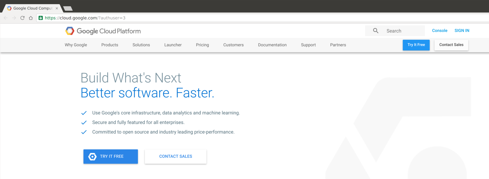
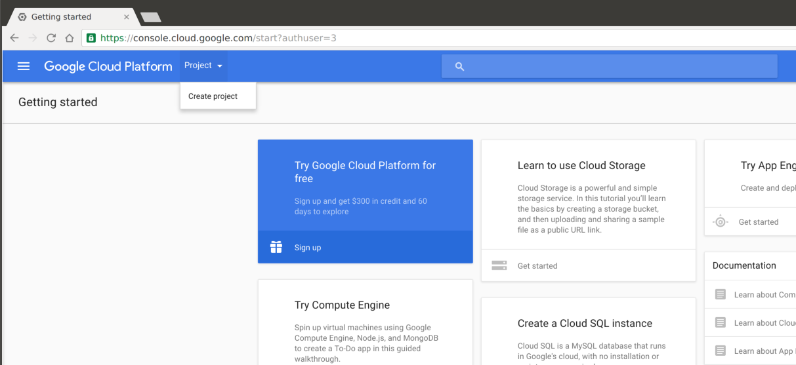
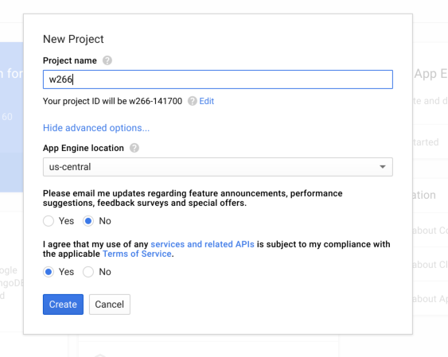
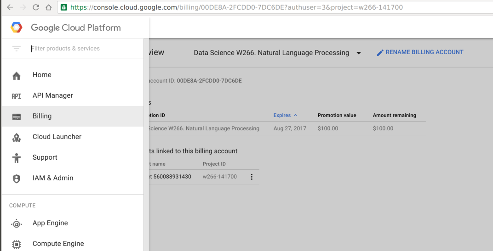
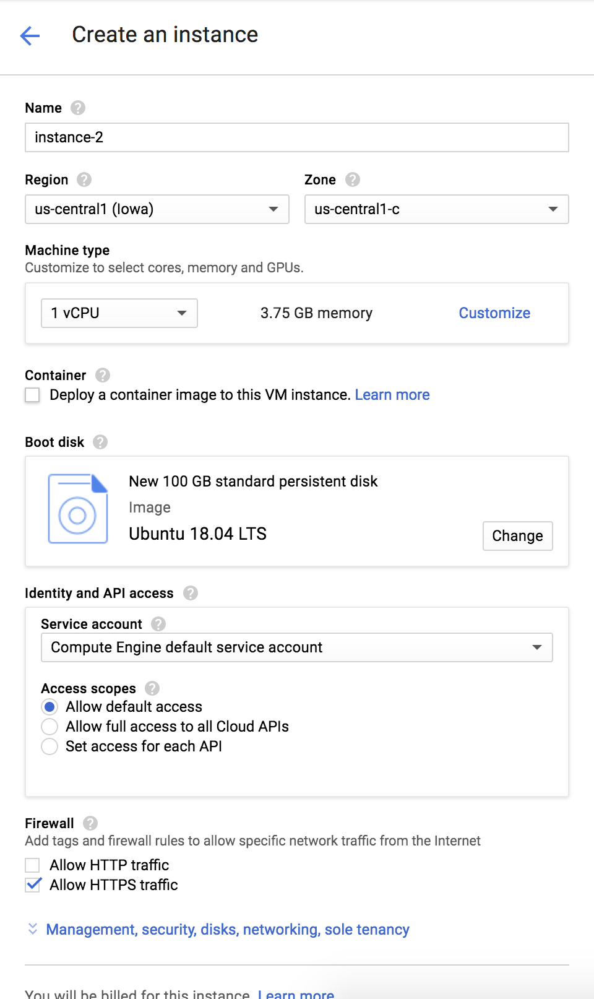
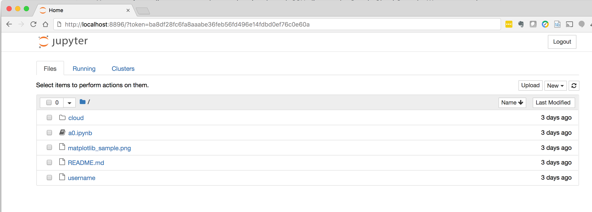
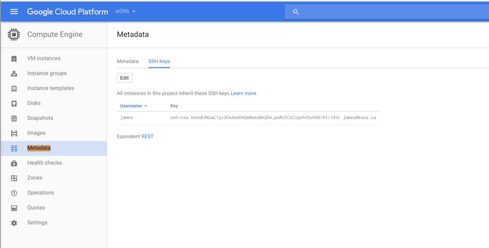
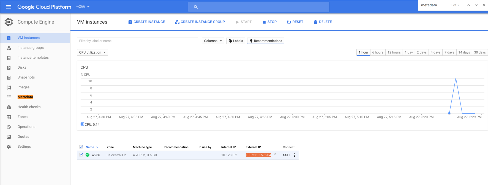

Cloud Instance Setup Instructions
=================================

Google has made $50.00 USD Compute Engine credits available to all of us.  There is some extra budget, but do not count on it.  Please **remember to shut down your instances** when you are done working.

Accounts, Projects and Billing
------------------------------

*  Make sure the **only** Google account you are currently logged in as is your [@berkeley.edu](http://bmail.berkeley.edu/) account. (_Not the @ischool.berkeley.edu one!_) 
*  Visit [cloud.google.com](http://cloud.google.com)
*  Click "Console" in the upper right corner.



*  From the "Project" drop down menu, pick "Create project" and fill in the resulting form.




*  Create a new browser tab.
*  In the new tab, visit https://google.secure.force.com/GCPEDU?cid=z%2BSC79BAw5INmTK7PKUVZIt1c18j2el%2BPw8zuPR0X3CxY0rSrD4rlf6Vq%2BarSwrz request a coupon, and follow the instructions.
*  Switch back to the original tab.
*  From the "hamburger" menu in the upper left corner, select Billing.



*  Verify the project is associated with your Compute Engine credits. You should see the course name in the Promotion ID field.

Start the Compute Engine instance
---------------------------------
*  From the hamburger menu again, select "Compute Engine"
*  (You may see a dialog box for a minute or two as Compute Engine initializes for your project.)
*  Click "Create"
*  Fill in the instance creation form as shown below. Don't worry about the cost; the rate shown assumes always-on, so you shouldn't come close to the limit if you shut down when not in use.

    * Name: w266
    * Zone: (pick one close to you)
    * Machine Type: 1 vCPUs, 3.75 GB
    * Boot Disk: Ubuntu 18.04 LTS (modify boot disk size to **100 GB**)
    * (Optionally) allow HTTP(s) traffic



*  Before clicking "Create", be absolutely sure that you have increased the disk space to at least 100 GB and have selected Ubuntu as your OS (the setup script that you'll run in a later step may not work otherwise).
*  Click "Create" at the bottom of the form.  You may need to wait a minute or two for your instance to boot.

The settings above (1 vCPU, 3.75 GB memory) should be fine for most parts of most assignments. For some assignments (particularly, training neural networks) and for your final project, you may need more juice. Fortunately, it's very easy to resize an instance. Go to the [VM Instances](https://console.cloud.google.com/compute/instances) page, shut down your instance, and select "Edit" to select the number of CPUs and amount of RAM you need. When you boot up the instance and log in, your configuration will be exactly the same, just with more power.

Connecting to your instance
---------------------------
Google Cloud provides a handy in-browser SSH client. Click "SSH" on the VM Instances page, and it'll automatically handle setting up SSH keys. If you want to use your own terminal, see below.

Setting up your instance
------------------------
In your terminal **on the remote instance**, type the following.

`setup.sh` installs Anaconda and TensorFlow. There are a handful of times you'll need to accept the license agreement or confirm an install path.  Just accept the defaults (though we won't be using visual studio in this course, so you can answer no to that if you wish), and **allow it to modify your .bashrc file**.

```
sudo apt-get update
sudo apt-get install git
git clone https://github.com/datasci-w266/2020-fall-main.git ~/w266
./w266/assignment/a0/cloud/setup.sh
source ~/.bashrc
```

_Note: if you're not using a Cloud instance, but are running Ubuntu on your laptop or a VM, you can also use `setup.sh` or cherry-pick commands from it to install the necessary packages._

Run a notebook and connect to it from your local machine
--------------------------------------------------------
In order to use Jupyter notebooks, we need to set up an SSH tunnel. This will allow the browser on your local machine to connect directly to the Jupyter server and Python backend running on your cloud instance. _All the below commands should be run **on your laptop**, unless specified otherwise._

* First, install the Google Cloud SDK for your operating system. Follow the instructions at: https://cloud.google.com/sdk/
* If it gives you the option to run an `./install.sh` script or similar, do so.
* Run `gcloud init`. When prompted, select the W266 project you created. When it prompts you to set up Google Compute Engine, say Y, and enter the zone of your instance as the default (this would be `us-central1-b` in our example).

* Run `gcloud compute ssh <instance-name>` to SSH to your instance. If it's your first time doing so, you'll be prompted to set up an SSH key. Enter a passphrase you won't forget!
  * Note:  If your local machine username is different from the VM instance username, you will want to instead run `gcloud compute ssh <vm-username>@<instance-name>` to ensure you login as the user where w266/ is located.
  * Also, if you have used Compute Engine for other projects, you may need to specify `--zone=<zone>` or `--project=<project>`.
* If you're able to log in successfully, hit Ctrl+D or type `logout` to exit.

* Run the following command *from your laptop*, which will SSH to your server _and_ tunnel ports 8896 and 6006:
```
gcloud compute ssh --ssh-flag="-L 8896:127.0.0.1:8896" --ssh-flag="-L 6006:127.0.0.1:6006" <vm-username>@<instance-name>
```
**Note:** port forwarding may not work properly using the web SSH client on the Google Cloud Console. We recommend installing the Cloud SDK and using it from the command line.

That's a lot to type every time, so you might want to make a [shell alias](https://www.digitalocean.com/community/tutorials/an-introduction-to-useful-bash-aliases-and-functions) for it. We chose port 8896 as the default for Jupyter (so as not to conflict with another local notebook you might have opened already), and we'll be using port 6006 to access some monitoring interfaces for TensorFlow.

* If you're successfully logged in, start a Jupyter notebook server **on your remote instance** with `jupyter notebook`. You should see a message like "`Copy/paste this URL into your browser when you connect for the first time, to login with a token: http://localhost:8896/?token=<hashcode>`":


* Open a browser on your laptop and copy the URL with token as shown in your console into the URL of your browser. (e.g. http://localhost:8896/?token=...). You should see the Jupyter notebook home (depending on where you ran the `jupyter notebook` command, you may need to navigate to the a0 assignment directory):


You might want to use `tmux` (or `screen`) to keep the notebook server running, even if you get disconnected or want to leave something running while you close your terminal. **On your instance**, run:
````
tmux new-session -s notebook
# should see a new terminal prompt
jupyter notebook
````

* You can hit `Ctrl+b` then `d` to detach from the session, and type `tmux attach -t notebook` to re-attach.
* More on tmux: [A tmux Primer](https://danielmiessler.com/study/tmux/)


Shutting down your instance
---------------------------
**Don't forget to shut down your instance**, or you will quickly use up all your free credits.

* The easiest and safest way to shut down your instance is to type the following in the ssh session:
```
sudo shutdown now
```

Alternatively, you can force your instance down by:

* Return to the "VM instances" page
* Tick the box next to your instance
* Click "STOP" in the header

Restarting your instance
------------------------

Restarting your instance is as simple as:

* Return to the "[VM instances](https://console.cloud.google.com/compute/instances)" page
* Tick the box next to your instance
* Click "START" in the header


Using your own SSH client (advanced)
------------------------------------
If you don't want to use `gcloud compute ssh`, you can do the following to access your instance like any other server:

*  Once it boots, click on the three dots next to "ssh" and pick "Use another SSH client".
*  Follow the instructions on the linked page to create ssh keys and install them on your instance via the "Metadata" section.



*  Finish following the instructions to ssh to your instance.  Note for this step, you'll need your machine's External IP Address which can be found on the main VM Instances screen.



Note: you won't have to set up ssh keys every time you connect (you'll simply reuse the ones you just set up).

Now you can SSH normally. To SSH with port forwarding for Jupyter and TensorBoard, use:
```
ssh -L 8896:127.0.0.1:8896 -L 6006:127.0.0.1:6006 <instance_external_ip>
```
